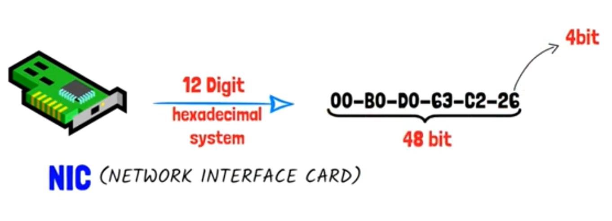

## Intro

- ISO Company decided to put standards for (The Network), To be suitable for all different OSs & Companies.

- ISO make (IEEE Company) put the (Reference Model of Network) that all companies will walk on it.

- (IEEE) Divided any (Network Connection) to (7 levels or 7 Layers), by meaning, When a device send (Data) to another one, It must pass on those (7 Layers). And The another device(Receiver) will pass on those (7 Layers) but from the end

- Those 7 Layers are Called [(OSI Model), open system interconnection model]

- [OSI Model] is the root of the (Network)

  

  

  

## OSI MODEL (7 Layers)

> ### Software Layers...

### 	`1. Application Layer`

​		This layer specifies the (Protocol) that make a (specific action) that user do.

​		`ex` 

- when you go to (Google),
- and write (www.google.com), 
- then Enter,
- you will find (https://) is appeared by default,
- (https://, hypertext transfer protocol secure) is the (protocol) of (searching) that (application layer) specifies for (current user action),
- And so on, When you make (download) for something on Internet,
- you will find the (protocol) of this (user action) is (FTP),
- And when you (send an e-mail) the (protocol) for this (SMTP).
- NOTE: there is a lot of (protocols) that is specified by (application layer) for different (user actions)

​	

### 	`2. Presentation Layer`

  - This layer takes (Human Language Data) Coming from (application layer) and convert it to (Computer Language 1s & 0s)

  - This process called (Translation), And is done for the computer can understand & deal with this (Data). 

  - After (Translation) process, it does another process called (Data Compression)

  - In that process, (presentation layer) Compresses (Data Files), To ease from (transferring process) and be done in short time

    `ex`

    - when you send a photo or video on (whatsapp), you will find the (size) of it is decreased, because of (Data Compression Process).

- Too, (presentation layer) do [Encryption] process on (Data) before sending it

- And (Receiver Device) will make later [Decryption] on that (Data) using (protocol) called [SSL]

- So, (presentation layer) does (3 main processes):

  - Translation
  - Data Compression
  - Encryption

### `3. Session Layer`

- Specifies The (Connection State) Using (Transmission Mode), if it:

  - simplex mode
  - half-duplex mode
  - full-duplex mode

- Authentication

  `ex`

  - when you try to get into a (server),
  - (server) ask you an (authentication),
  - by making you input (username & password),
  - to know "who are you",

- Authorization

  `ex`

  - After (authentication) succeeded, and you get into you account,
  - and now, you try to make access on (specific protected file) on the (server),
  - the (server) will ensure if you have the right & permissions to access that file or not,
  - and this process called (authorization)

- Session Management

  `ex`

  - when you are connected to internet, and try to get into a website like (Facebook)
  - you will find the (Videos, images, and texts) that were loaded for you in the last session you opened (Facebook)
  - and this happened because (Session Layer) take those (Data) and store them temporary
  - and when you get into (Facebook) again, It will restore (Data) for you at the next time,
  - until you are offline at that time

=====================================================================

### `4. Transport Layer`

​	The most important layer in the (OSI Model),

- It is the layer responsible for (Data Transferring)

- Do important process called [Segmentation], How?!:

   - it takes (Data) from the previous layer(Session Layer)

   - and divided it into (Segments) or small parts, to make transfer process easy

     `ex`

     - when you try to download a file 

     - and some problem happened to it during (downloading process)

     - after solving that problem, you will notice that the browser don't start (downloading process) from the beginning

     - but you will find it starts from the (segment) where (corruption) happened

       

       

  - Each (segment) of them have:
    - port number 		=> to make the (Segment) knows which app it is work on
    - sequence number => to preserve order of the (Segment)
    - To form the message at the end, and later, this message reach correct to the (Receiver) after (De-segmentation Process) happened on it there.

  

- [Flow Control], It control the amount of (Transferred Data) or (Transfer Rate)

  `ex`

  - If you want to transfer data from (PC) to (Phone)

  - PC       => can transfer (100 megabit per second) as maximum

  - Phone => can receive (10 megabit per second) as maximum

  - At that case, if you tried to execute the transfer process from PC to Phone

  - And as example the (transfer speed) will be (50 megabit per second)

  - you will notice that it is more than (the maximum receiving rate) of the (phone)

  - at that moment, (phone) will send feedback to (pc) to decrease (transfer rate) to (10 megabit), so that there is no (data loss)

  - The same Case will happened if we assume that (pc) transfers with (rate) equal (5 megabit)

  - At that time, (phone) will send feedback to (pc) to increase (transfer rate) to (10 megabit), to preserve transferring performance.

    

- [Determine Protocol], It determines the type of used protocol of (transferring process) according to (the current user action). And we have 2 types of (transferring process protocols):

  - TCP(transfer control protocol):
    - called (connection oriented transmission)
    - (so accurate) in transferring data
    - sends data and ensure all (segments) arrived
    - wait (Receiver) feedback or acknowledge after each segment, to ensure that it arrived successfully
    - and then it send the next (segment), and so on
    - Good in (sending important reports or files)
  - UDB(user datagram protocol)
    - called (connection less transmission)
    - It is not (so accurate) in (transferring data)
    - but it is (so faster) than (TCP)
    - Good in (calls, video or audio chatting, video games, &watching films)

  ######  `Note : choosing between using (UDB) or (TCP) is specified automatically by (Transport Layer)`

### `5. Network Layer`

 - [Logical Addressing]:

   - as we know, each device has its own (IP Address), to be able to reach it across this (IP)

   - (Network Layer) receives the (Data Segment) from (Transport Layer), then add before it (IP Addresses) of (Sender) & (Receiver). And the combination is called (Packet), And it is the (Data Unit of Network Layer).

   - So, (packet) consists of (Receiver IP + Sender IP + Data Segment)

   - we can call these previous steps with (IP Addressing).

     

     

 - [Routing]:

   - Process of choosing the best path of transferring (Data) from (Source Device) to (Destination Device).

   - (Network Layer) can do (Routing Process) using a group of specific protocols 

     - RIP 	=> (routing information protocol)
     - OSPF  => (open shortest path first)

     

### `6. Data Link Layer`

 - As we agreed, the (packet) consists of (Receiver IP + Sender IP + Data Segment), which called (logical addressing or IP addressing) that happened in (Network Layer)

 - now, we have another type of addressing is called [Physical Addressing]

 - [Physical Addressing] is handled in (Data Link Layer) using MAC Address(media access control).

 - So, we can say that, (Data Link Layer) receives (Data Packet) coming from (Network Layer), then add to it (Sender MAC Address) & (Receiver MAC Address), to make up the (Data Unit of Data Link Layer) which is called (Frame).

 - And all the previous process is called (Frame Encapsulation).

 - (Frame Encapsulation Process) happens for the device which send the (Data)

 - And as we said previously, at (OSI Model) each step happened in (opposite manner) for (Receiver Device).

 - So, When (Receiver Device) receives this (Frame), it will read (MAC Addresses) of (Sender) & (Receiver) devices, then make (Decapsulation Process), To can get the (Data Packet), Then get into (Transport Layer),  Then (Upper Layers) and so on, Until reaching (Application Layer).

   

- (MAC Address): 

  - is a (physical number) of (NIC Device(network interface card)), The manufactured company is that putting this (physical number)

  - consists of (12 digits) in (hexadecimal system)

  - each digit is (4 bits)

  - so, any (MAC Address) is (4 * 12) equals (48 bits)

    

- (Data Link Layer) make the (Upper Layers) can access (Media or in other meaning Transmission Media)

- (Transmission Media) is the (physical link) between any 2 devices or Networks

  `ex`

  - if I there are a (Laptop) & (PC) want to talk to each other

  - each one of them in a different (Network)

  - So, they must use (Network Layer Protocol) like (IP), to can connect to each other

  - Assume that, the (PC) is connected to (Router 1) using (Ethernet Cable)

  - And, the (Laptop) is connected to (Router 2) using (WIFI or wireless communication)

  - And between (Router 1) & (Router 2) there is a (wireless communication)

  - now, this (PC) want to send a message to that (Laptop)

  - So, according to the (transmission media) between (PC) & (Router 1), (Data Link Layer) will add (Head & Trailer) for the (IP Packet) that are (MAC Addresses of Sender & Receiver), To make up the (Frame), that is in this case is (Ethernet Frame)

  - After that, (Router 1) will receive (Ethernet Frame) and makes (Decapsulate Process), to take the (IP Packet) alone. Then make (Encapsulate Process) again, to make up (new Frame) with (new Head & Trailer) according to the type of (current transmission media)

  - After that, (Router 1) sends this (Frame) to (Router 2) across (Radio Frequencies)

  - (Router 2) will make (Decapsulate Process) for this (Radio Frame), to get (IP Packet). Then (Encapsulate Process) to make (wireless Frame)

  - Finally, the (Laptop) will receive the (wireless Frame) by the (Laptop NIC Device) and make (Decapsulate Process) for the (wireless Frame), to get the (IP Packet). Then (Data Link Layer) will send the (IP Packet) to the (Network Layer), then (upper layers), until reaching (application layer). And the (Application Layer) will make that sent message appears on (Laptop Screen).

  - According to this example, we can conclude that, (Data Link Layer) can do [Framing Process] by adding (Head & Trailer) for the (IP Packet) according to the type of (used transmission media)

  - And, can make [access for transmission media for upper layers] of (OSI Model)

    

- [Error Detection & Correction]:

  - during the (transferring process), it is possible for that transferred data to affect external factors cause errors in Data

  - (e. g. existing a magnetic field near to the wire which transfers the data)

  - So, (Data Link Layer) is responsible for ensuring that (Data) reaching correct & didn't be affected with any external factors

  - and (Data Link Layer) can detected the errors using specific protocols

  - And, if (Data Link Layer) detected an error at specific (Frame), it will discard it and request this (Frame) from the (Sender Device) again

  - we have 3 techniques for detecting errors in (Data Link Layer):

    - (Parity Checking):

      

      . We know that, the (Transferred Data) is a (stream of bits or 0s & 1s)

      . this technique counts the number of (1s) I have

      . And if (1s) number is even, then (parity bit value) equals (0)

      . and vise versa, if (1s) number is odd, then (parity bit value) equals (1)

      . after that, this technique starts to compare between (values of parity bit) in (sender) & (receiver)

      . if the both are equal to each other, then (Data Link Layer) will accept this (Frame)

      . otherwise, I have error in (sent Data), and it will discard this (Frame) and request it again from the (Sender Device)

      . note that, this technique is very good if I had error in (single bit) of the (frame)

      . but if I lost (2 bits) as example, then the (number of odd (1s) will still odd) & (number of even (1s) will still even)

      . so, we couldn't recognize that there is an error

        

    - (Check Sum):

      . It takes (Data Frame) and make (summation operation) on it with (1st Complement)

      . so, the result of this operation will be that (all digits are 1s)

      . after that it will make a complement for this (result), So, the whole digits will be (0s)

      . After that it will compare, if the whole digits are (0s), then this (Data Frame) was has been sent correct, then (Data Link Layer) will accept it

      . otherwise, error happened for the (Data), And the (Data Link Layer) will reject this (Data Frame) and request it again form the (Sender Device)

        

    - CRC(cyclic redundancy check):

      . It looks like the (Check Sum Technique) but with little differences.

      . It executes specific (mathematics equation) on the (Data Packet) of the (Sender)

      . And then, It puts the (Result of this Equation) in the (Trailer) of the (Data Frame)

      . And Later, when the (Data Frame) reach the (Receiver Device), It will execute the same (equation) on this (Data Frame)

      . and now, (Data Link Layer) can compare between the (result of the equation) for the (Sender & Receiver)

      . (Receiver) will accept the (Data Frame) if both are equals

      . otherwise, an error has been happened, and (Data Link Layer) will request this (Data Frame) again from the (Sender)

      

    

- (Data Link Layer) uses a (Protocol) called (CSMA, carrier sense multiple access).

  `ex`

  - if I have 3 devices connected to a (Router) with the same (transmission media)

  - this mean that the 3 devices have the same (physical link)

  - now, when the 3 devices send (Data) at the same time, then it will happen a collision among those (data)

  - So, the (Data Link Layer) solves this problem using (CSMA Protocol)

  - when 1 device from these 3 devices try to send a message, this protocol will see the channel or (transmission media) and look at if there is another (signals or messages) have been sent at the same time on this (Link) or not

  - In short, (CSMA Protocol) monitors the signal on the (transmission media wire), and when it finds the wire is (Idle) and no message is sending then, Then It will let the device to send its message

    ,

### `7. Physical Layer`

 - we agreed that, (Data) divided into parts called (segments) in (Transport Layer)

 - then, adding (source IP) & (destination IP) before (data segment) in (Network Layer) to have a (Packet)

 - then, adding (source MAC & destination MAC) before (IP Packet) to have a (Frame) that is (a group of bits).

 - So, the data reach (Physical Layer) on shape of (Stream of bits)

 - now, (physical layer) starts to convert those (stream of bits) to signals (according to transmission media) to be able to deal with it, Because there is no (transmission media) can understand (0s & 1s) that Computer understands

 - The Signals will be converted can be:

    - (electric signals): at case of (wired communication) like (Ethernet Cable or Coper Cable)
    - (optics signals): at case of (wired communication) like (fibber optics)
    - (radio signals): at case of (wireless communication) like (WIFI) across air

- In short, 

  - (physical layer) in (sender device) converts (bits) to (signals) according to the (transmission media) of it.

  - then, these (signals) transfer across this (transmission media) until reaching to (physical layer) of (Receiver)

  - then, these (signals) will pass all over (upper layers) but in the (opposite manner), until reaching to (application layer), to show the message on the (laptop screen) of (Receiver).

    

    

    

    

### `short story`

- assume "person A" want to send a message to "person B"

- (A) opened the browser

- and wrote (facebook.com)

- (A) found (https://) appeared before what he wrote, by default

- And this is the (protocol) responsible for (searching) that (application layer) added

- then, in (presentation layer), (Encryption process) will happen, (by converting files of html and JS) to (XML files) for the browser can understand it and show it

- then, in (session layer), the (transmission mode) will be specified if it (simplex, half-duplex, or full-duplex mode), and in this case will be (full-duplex), because we are in the case of chatting between (2 persons), and the talking happens in the (2 directions). in other meaning the other person can send a message at the same time. 

- now, the (software layers) ended.

- then, (transport layer) will take the (Data) from the previous layer and divided it into (segments), and choose which (protocol) will it use in (transferring data), either (TCP) or (UDP). And in this case, it will use (TCP), Because this is more accurate protocol that will send this message accurately.

- then, (Network Layer) will take this (Data Segment) and assign (Destination & Source IP) before it, to make up the (Packet) or the (unit data of Network layer)

- then, (Data Link Layer) will take this (IP Packet) and assign (Destination & Source MAC) before it, to make up the (Frame) or the (unit data of Data Link Layer)

- then, in (physical layer) this (Frame) will be (a group of bits) that will be converted into (signals), to be able to be transferred in (transmission media), until reaching (physical layer) of (Receiver Device)

- After that, (Data) will get out from (physical layer of receiver device) to (data link layer) that will make (decapsulation process) for the (Data Frame), and (looking at MAC address of Receiver, now) and comparing it with (MAC address of Receiver that got out from the Sender), if it find the both are the same, then (data link layer) will accept this (frame), else will reject it.

-  after accepting the (frame), it will go to (Network layer), that will look at (IP address of Receiver) and compare it with the (IP address of Receiver that got out from the Sender) if it find the both are the same, then (Network layer) will accept the (IP Packet), else rejects it

- and so on, all over the (upper layers) ....

- until reaching the (application layer) that will make the message appears on the (Laptop screen) of (B) using (application layer protocols).

- Note : All those operations happens in (Micro Seconds).

  

  