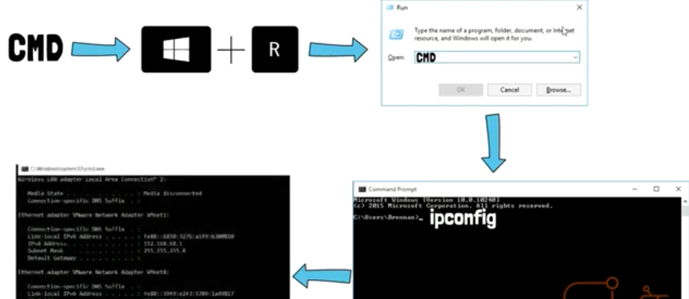
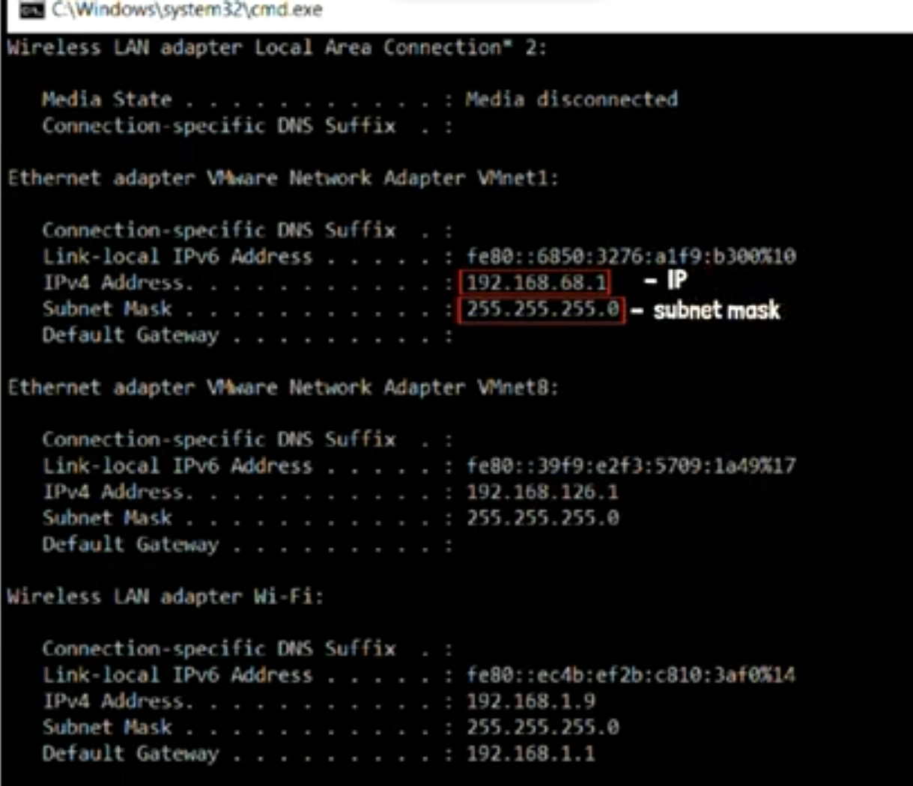
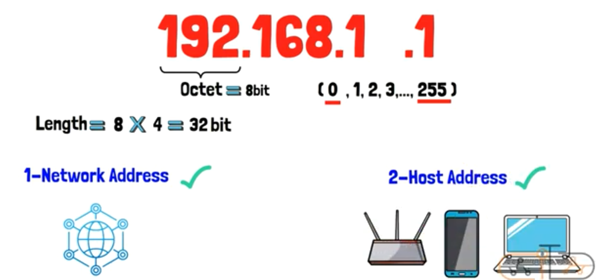
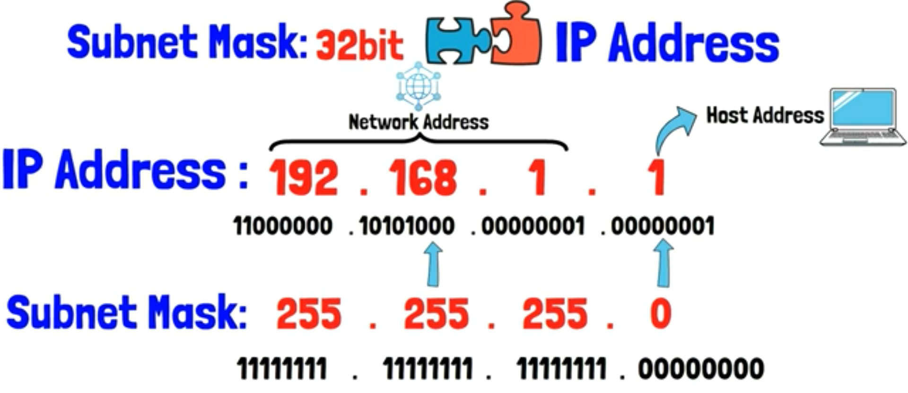
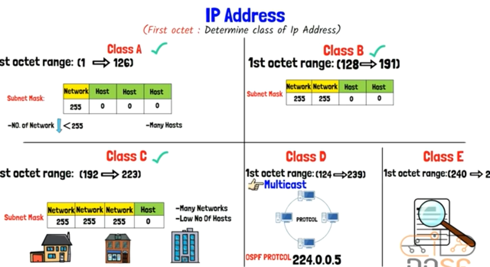
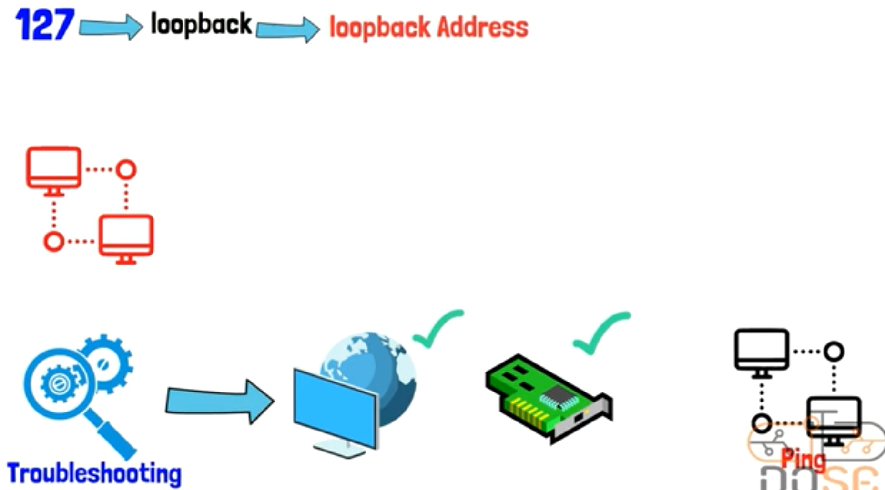
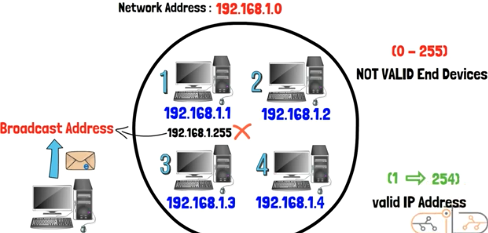
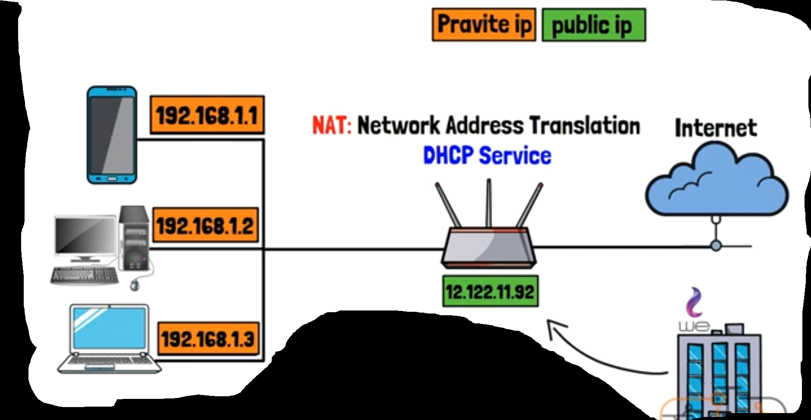
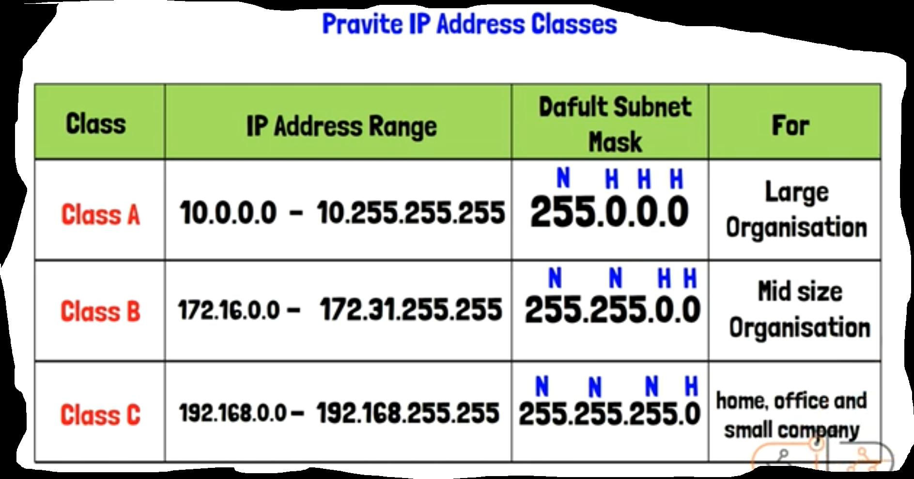
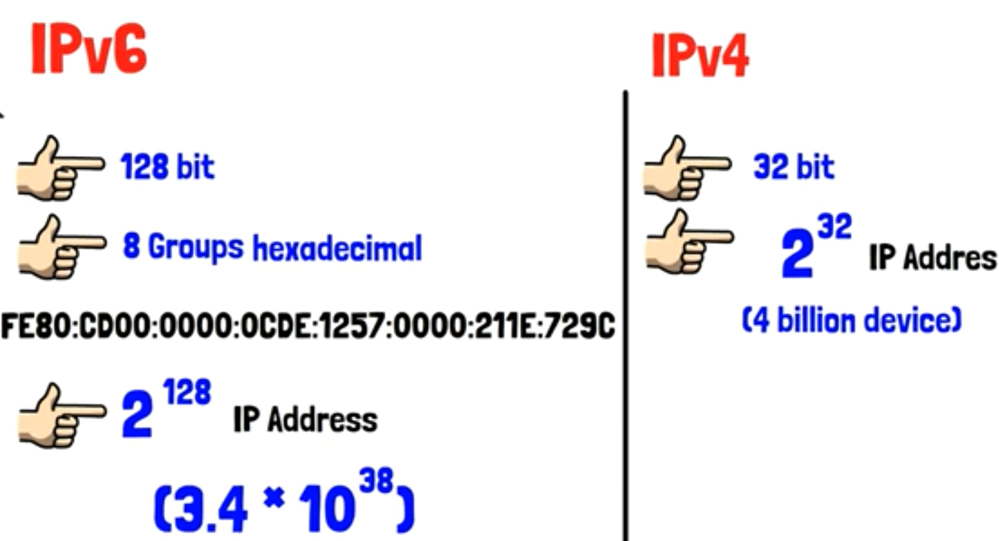

## Intro

To be able to send files, or any data from a device to another, You should know the address of the receiver device. So Addresses of devices called (IP Address).

### 

## IP Address

- It refers to (Internet Protocol), It is the set of Rules that any device must adhere to it when sending Data to another one.

- Imagine if devices don't have (IP), you won't be able to send anything. (No Internet)

- e. g. When you watching a video on YouTube. (YouTube) sends Data to your own (IP Address)

- To know your IP Address of your device:

  

  

  

- (IP Address Properties), It consists of:

  - 4 parts

  - each part called (octet)

  - each (octet) equals (8 bits)

  - so, the length of (IP) = 4 * 8 = (32 bits)

  - each (octet) can carry a number from 0 to 255. (written in decimal representation)

  - (IP Address) contains on, 

    - (Network Address): The Address of Network Itself

    - (Host Address): The Address of the Device inside that Network

      

    - The sender Device will be able to distinguish between (Network Address) & (Host Address) by (Subnet Mask)

      

- (Subnet Mask): 

  - Its length is (32 bits), too

  - It always comes with (IP Address)

  - e. g. (if i have IP address 192.168.1.1)

  - The (subnet mask) coming with it will be (255.255.255.0)

  - In (IP Address) 

    -  (192.168.1) refers to the (Network Address) that the destination device exists in it
    -  (.1) refers to the (Host Address) of the device inside this network

  - Notice that => (IP Address) And (subnet mask) in decimal representation, so it will be convert to binary for the devices can deal with them

    

## IP Addresses Classes

- Engineers who developed the (IP Addresses) Categorized them into (4 Classes)

- Each Class has specific use

- We can Distinguish among (IP Addresses Classes) using the (first Octet):

  - Class (A):

    - IP Address 1st Octet range => 1 to 126

    - Subnet Mask                      => 255 . 0 . 0 . 0

    - Its Uses                              => (few Networks less than 255), but (a lot of Devices at each Network)

      

  - Class (B):

    - IP Address 1st Octet range => 128 to 191

    - Subnet Mask                        => 255 . 255 . 0 . 0

      

  - Class (C):

    - IP Address 1st Octet range => 192 to 223
    - Subnet Mask                       => 255 . 255 . 255 . 0
    - Its Uses                      => (Homes, Offices, and small Companies). (a lot of Networks), (few Devices)

    

  - Class (D):

    - IP Address 1st Octet range => 224 to 239

    - Its Uses

      . for (Multicast)

      . e. g. (if i have some devices that deal with a specific protocol)

      . maybe i want a specific (Multicast) for those devices who deal with that Protocol, only

      . such as (OSPF Protocol) that its own Multicast is (224. 0 . 0 . 5)

      . the meaning of this (Multicast) is that (All devices that uses OSPF Protocol) can connect with each other using this (Multicast)

      

  - Class (E):

    - IP Address 1st Octet range => 240 to 255

    - Its Uses                              => for researches & experiments of (IP Addresses) 

      

- If you want to assign an (IP Address) for a (Network) or a (Device), you will use class A, B, or C only

- Because the D, and E are used for (special purposes)

  

- If you noticed in the categorizes of (IP Addresses) you will find that we missed (1st octet of 127) between the class A & B

- (1st octet 127) => is reserved as (Loopback Address). (Your device can talk to itself using it)

- you can try to open your (CMD) and write this command (ping 127.0.0.1) to test (pinging) on your device

- also, we use it for (troubleshooting) on (My Internet) & (LAN Card or NIC Card), to check if there is a problem with them or not

  

- (Another Note) => If I want to connect some devices using a network

- in this case i must give each device a specific IP address 

- it isn't allowed to give this IP Address for any device => (192.168.1.0)

- Because the (Host Address) of (0) is reserved for (Network Address) itself

- And it isn't allowed to give this IP Address for any device, too => (192.168.1.255)

- Because this is the (Broadcast Address), that reserved for if you want to send data to all devices inside that Network Address

  

## IP Addresses Types

> public

-  when you apply to an internet service from any (internet service provider company)

- (this internet service provider) will determine a (public IP Address) for your (Modem or Router) you will take

- to be able to get into internet using it

- and without this (public IP Address), you won't be able to get into the internet

- the (public IP Address) is UNIQUE, It isn't allowed to 2 devices have the same (public IP Address)

  - `story`

  - The Old Days, IPV4 (IP version 4) => can provide different (4 billions IP Addresses) almost

  - And Engineers hadn't imagine the internet user will increase like we are now

  - until after appearing of something called (IOT) there is a lot of home devices can use internet service

  - so, these (4 billions IP Addresses) won't be enough for all that
  - so, Engineers think about in another idea called (Private IP Address), to solve this problem

> private

- Private IP Addresses aren't registered on the internet

- in another meaning, you can't get into the internet using (private IP Addresses)

- Because (Private IP Addresses) are used internally. (Home or Company range)

- And (Public IP) is the IP that will appear to the internet during dealing with it

- In your Router, There Is a Service Called (DHCP Service). It gives the devices in your Home their (Private IP Addresses)

- So, The (DHCP Service) gives each Device a (private IP Address)

- And when there is a device want to access the internet, this (private IP Address) will be translated into the (Public IP Address) to be sent to the internet 

- This translation process will be done using (NAT, internet address translation) Service that exists in your Router

- (NAT) can translate from private to public & vice versa. (If there is a device on the internet want to talk to your device, the NAT will convert from public to private at this case)

  

  

- Private IP Addresses are categorized into (3 Classes)

  - Class (A):

    - start with 10
    - give you (few networks), but (big range of devices
    - it is used for the big companies

  - Class (B):

    - start with 172
    - it is used for the medium companies

  - Class (C):

    - start with 192
    - is is used for homes, or small companies
    - it is the (Private IP Address) that you use to get into (Router settings)

    

    

- Engineers didn't Stop, and considered the (private IP Address) idea is only temporary solution for the problem. (They Developed another Version of IP Addresses Called IPV6)

## About IPV6

- it consists of (128 bits)

- it is written in (8 groups of hexadecimal representation). (so, it contains letters and numbers)

- if you noticed, in the (IPV4), it consists of (32 bits) only => 2 to the power of 32 = 4 billion device almost

- but, 2 to the power of 128 => 3.4 * 10to the power of 38

- but now, (IPV6) isn't widely-used, and (IPV4) still remains widely-exist

  

  