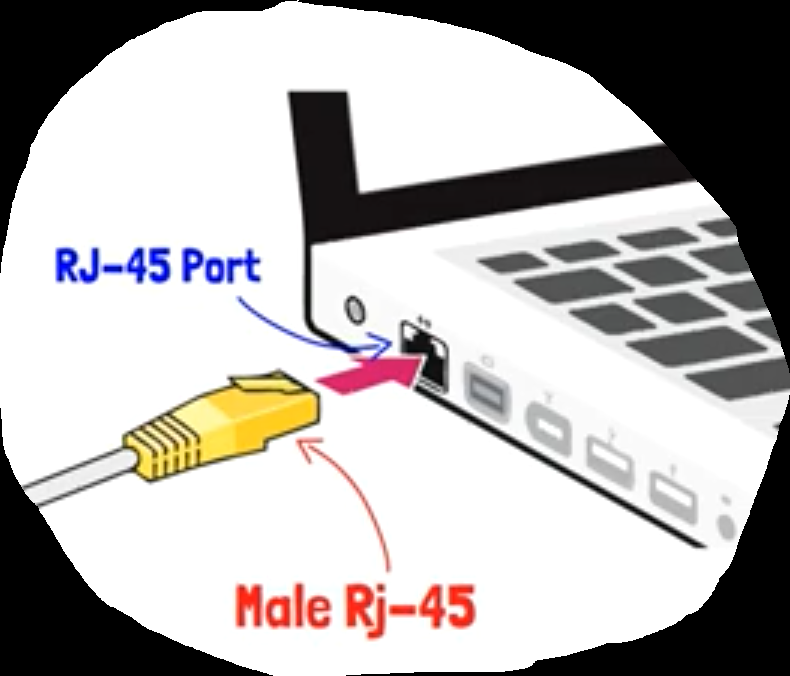
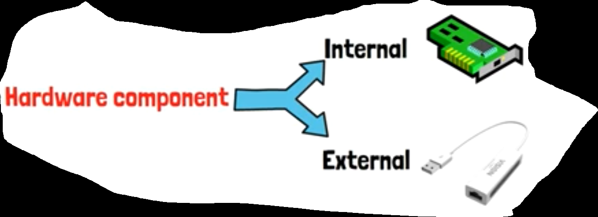
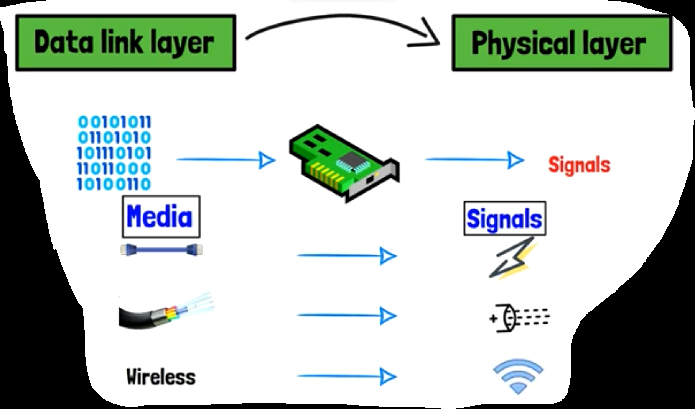
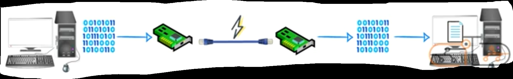
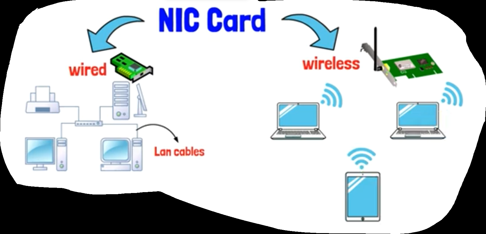
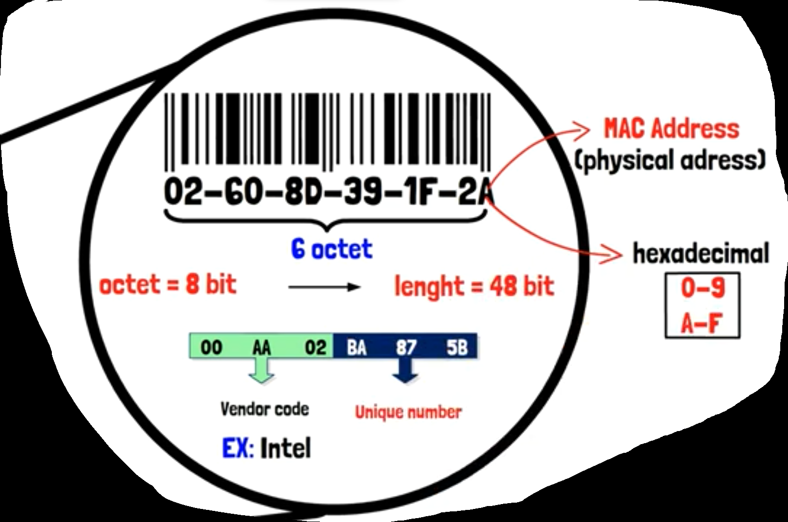
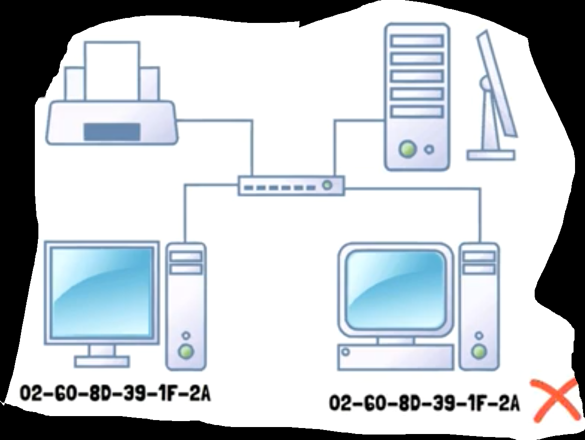
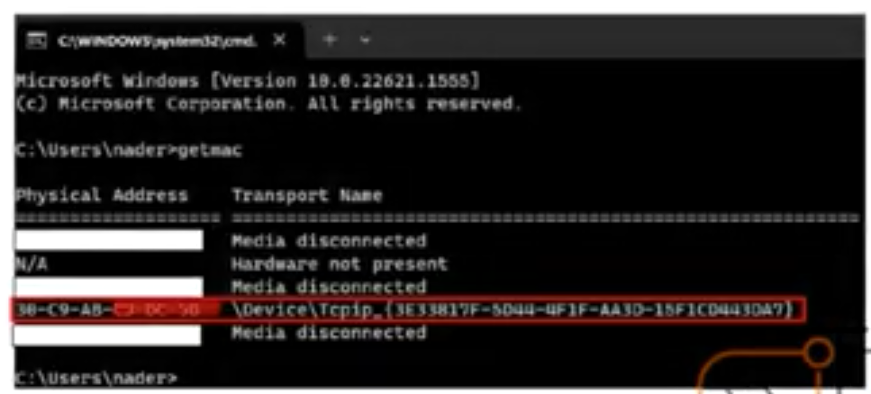

## Intro

- At old days, when you wants to connect to the internet, your device must have (Network Interface Card [NIC])

- then you connect ( the Internet wire tip [Male RJ-45]) to (Internet slot on your device [RJ-45 Port])

  

- behind (that internet slot on your device), there is an embedded electronic circuit => (NIC)

## NIC - Network Interface Card

- It is a Hardware Component often built-in your device, or you can get it external (using a USB NIC device)

  

- we use it to be able to make a (Network) among a group of devices

- and using it we can share data & files among those device inside that Network

- Data Link Layer -> Physical Layer => (That is the task of NIC), because it can convert (0s & 1s) that computer understands to (signals) that (transmission media) can deal with

  |    In    | 0s & 1s are converted to (and vice versa) |
  | :------: | :---------------------------------------: |
  |  Wired   |             electric signals              |
  | Optical  |               light signals               |
  | Wireless |               radio signals               |

- So, NIC is the hardware tool that can convert (message shape), to be able to pass from (transmitter device) to (receiver device)

- So, we can say that, (without NIC, No Network)

- Types of (NIC):

  - Wired    => ex: wired network interface card that is used with (LAN Cables) to transfers data among devices
  - Wireless => ex: wireless network interface card that is used with (connecting wireless devices) like (phones, tablets, and laptops). (It is build-in those devices)

  

## More Info About NIC

- Companies that manufactures (NIC devices)
  - INTEL
  - BROADCAM
  - TP-LINK

- These Companies adds for (NIC devices) something called (MAC Address)

  - MAC Address is a (Physical Address) written in (hexadecimal representation)

  - Contain from (6 Octets)

  - each Octet is (8 bits)

  - so, MAC Address length = 6 * 8 = (48 bits)

  - the first (3 Octets) are special for (Manufactured Company) => (the first 3 octet for Intel company are the same)

  -  the last (3 Octets) are UNIQUE numbers => (They distinguish each NIC from another one)

  - so, we can say that, (It is impossible for 2 devices to have the same MAC Address)

    

    

    

  - Devices can call each other using (MAC Address)

## How to know your (Device MAC Address)

- 1st way
  - from search
  - get into (network and sharing center)
  - get into (your connections). (like WIFI)
  -  then choose (details)
  - you will find (MAC Address) besides (Physical Address)

- 2nd way

  - from CMD

  - write command (getmac), then enter

    

    