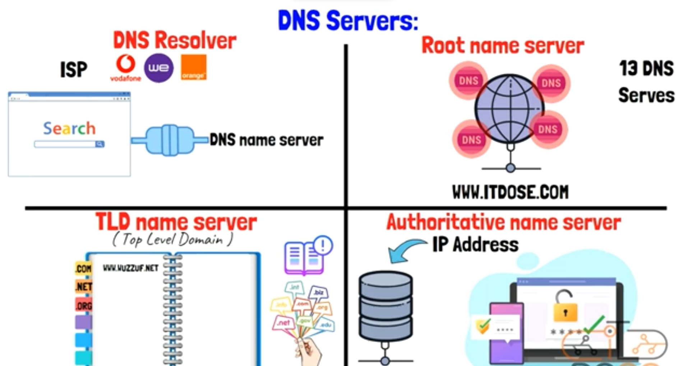
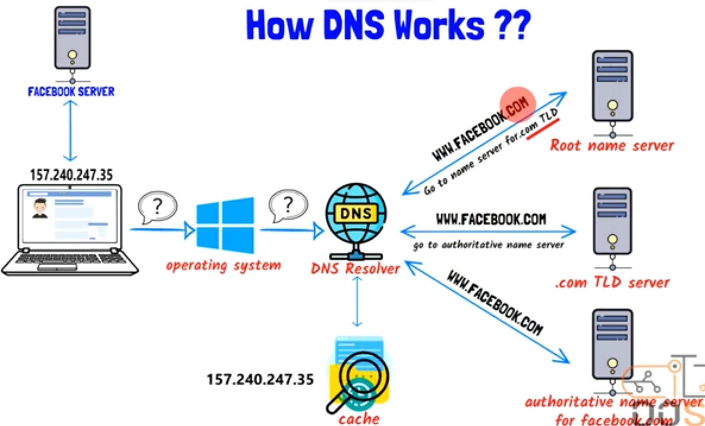

## Intro

- As we know, Device can recognize & talk to each other by (IP Address)

- also, Devices can't understand Human Languages

- but if that so!, how when i write a link like (www.facebook.com) using Human Language, it is understanded by the device browser?

  => (Notice that, I don't know the IP Address of the server device that stores that Website)

- That's the major of (DNS)

## DNS

- stands for (Domain Name System)
- It is considered as the (mid-translator) between (us & web-browsers)
- it is major looks like when you call someone from your phone
- at this case, you previously saved his phone-number and & name
- And now, you can reach & call him by searching only for his name
- so, the name only take me to the person-phone-number to be able to call him
- so, when you get into browser
- and write something like (www.google.com)
- DNS will translate what you wrote to its opposite IP Address (74.125.68.102), that computer & browser can understand
- Then Browser will take this IP Address and Access (Google Website) from its location on the server
- you will find the content of (Google Website) be loaded into your Local Device => (photos, txt, html, etc.)
- so, we can say that => (DNS is Phone-Notepad of the Internet)

## DNS Servers Types

`DNS Servers`

- In General servers are Machines with Super-Performance
- They can store (html, photos, videos, sounds files, and etc.)
- DNS Servers are worked together to provide the requested (IP Address) by Browser

`DNS Servers 4 Types`

- DNS Resolver

  - comes from (Internet Service Provider, ISP)

  - It connects your Device Browser with (DNS Name Server)

    

- Root Name Servers
  - They are 13 (DNS Servers) all over the world
  - They are an exact copy of each other
  - ex:
  - when someone buy a (Domain) like (www.example.com)
  - It is saved on 1 of those 13 (DNS Servers)
  - And at the same time, Other servers are aware of this new domain

- TLD Name Server => (Top Level Domain)
  - It Stores Information about all domains that have the same (domain extension)
  - such as, (.com TLD Name Server) => (stores all information of all websites that end with [.com])
  - ex: => (.com, .net, .org)

- Authoritative Name Server
  - Stores (IP Address) of the (requested website)
  - and ensure if the (user) have the right access to that (IP Address) or not

## How DNS Works?

- How DNS can load any website?
- assume that you want to access FACEBOOK
- you will go to your browser and write (www.facebook.com)
- now, browser won't understand what you wrote
- so, browser will send (a query) to (your operating system)
- then, (operating system) will forward this (query) to the (DNS Resolver)
- (OS) asks (DNS Resolver) => Do you have the opposite [IP Address] of domain of [www.facebook.com]?
- So, (DNS Resolver) will go to search in its (Cashes) if it has the (IP Address) for that website domain or not
- (Note) => if you previously launched this website, DNS Resolver will get it from Cashes & send it fast
- but, what will happen if (DNS Resolver) didn't find an (IP Address) for the requested website domain?
- At that case, (the query) will reforward to (Root Name Server)
- then, the first thing (Root Name Server) will do is check the (extension) of this website domain. ex: (.com)
- And according to the (extension), (Root Name Server) will send the (IP Address) of (.com TLD Name Server) To (DNS Resolver)
- (Note) => now, only (.com TLD Name Server) was send to (DNS Resolver)
- After that, (DNS Resolver) will communicate with (TLD Name Server) to know the (IP Address) of the (Authoritative Name Server) that's already (requested website IP Address) stored inside it
- Finally, (Authoritative Name Server) will send the exact (IP Address) of (facebook.com) to (DNS Resolver)
- facebook.com => 157.240.247.35
- now, (DNS Resolver) can store all of these information at its Cashes. to can be accessed fast, later
- (DNS Resolver) sending the (IP Address) to (OS)
- (OS) sending the (IP Address) to (Browser)
- (Browser) communicate with (FACEBOOK Server) to load its contents for you
- (Note) => all those operation happens at each time we wrote (a website or link domain) for the first time

## Can we do without DNS?

- what will happen if there is no DNS?
- at this case we must save (IP Addresses) in our brain
- www.google.com => 172.217.167.46 => (browser can understand this)
- if you gave that (IP Address) for the (Web Browser)
- and at this case, the website domain will open without needing for DNS Steps
- you should know that, (Websites) increase daily
- so, it impossible to memorize all (IP Addresses)
- so, the easiest way is to memorize the (domain names) like that => www.google.com
- so, we cannot do without DNS

