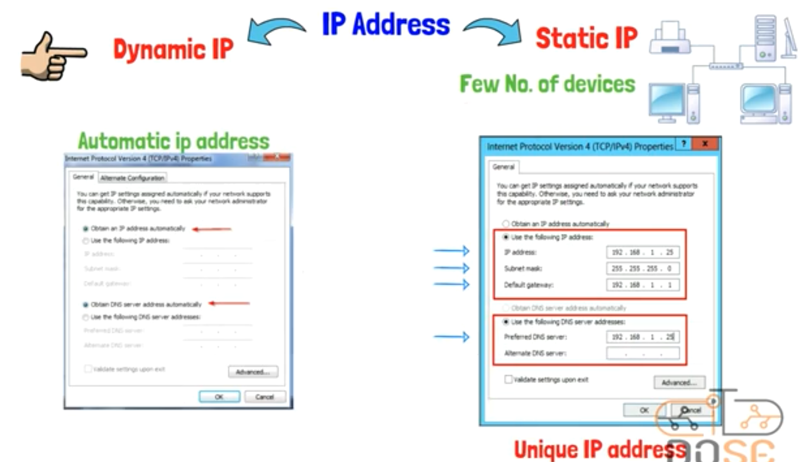

## Intro

- imagine with me,
- if you bought a new Router
- and make a configuration for it
- previously, we learned that (IP Address) for any device want to connect to the internet is so important
- you will notice that after making configuration for that new Router, you don't need to specialize a new (IP  Addresses) for your devices you want to connect it to that new Router
- in this lesson we will know How (IP Addresses) are be handled for Connections with The Internet By something Called (DHCP) is built-in Any Router

## Handling IP Addresses For Devices

- There are 2 Types of (IP Address) that I can give it to any device:

  - `Static IP`

    - It must get into each device and adjust (IP Address settings) for it manually

    - like giving it, IP Address,

    - Subnet Mask,

    - Default Gateway,

    - And DNS

    - And it must ensure that I didn't make a duplication for (IP Address) to and 2 devices

    - Because as we know (IP Address is UNIQUE)

    - (Note): If 2 devices have the same (IP Address) => this will cause IP Conflict, and the 2 devices won't be able to connect with the rest devices in that Network

    - Notice that this way will be useful with (Network that contains few devices in it) => ex: 3-devices

      

  - `Dynamic IP`

    - But now, Imagine you have a Network from (200-devices)!
    - at this case, we will resort to using (Dynamic IP)
    - and Dynamic IP means each device will take its (IP Address) Automatically from (DHCP Server)

    ​      

    ​      

    - you can know these info. about Static & Dynamic IP on your devices using command (ipconfig /all)

      

      

- The Process Giving (IP Address) to a device By (DHCP Server) is called (DORA Process)

- (DORA Process) => (Contains 4 Steps):

  - `Discover`
    - the first time we connect a device in a Network, this device won't have an (IP Address)
    - at that time, (MAC Address) will be the lone way for connection with the internet for this device,
    - Because then this device doesn't have any info. about the Network
    - So this Device will send a (Packet Broadcast) for (all devices in this Network)
    - This (Packet Broadcast) is called (DHCP Discover)
    - Its (source IP Address) is (zeros) like that => 0 . 0 . 0 . 0
    - And (Destination IP Address) is the (Broadcast IP Address) => 255.255.255.255

  

  - `Offer`
    - After that (Packet) or (DHCP Discover) Reach to (DHCP Server) 
    - (DHCP Server) will understand that there is a device want to join this Network
    - at that time, (DHCP Server) will response to that new device want to join
    - and will send to it a message contains (Proposed IP) like that 192.168.1.15,
    - (Subnet Mask) like that 255.255.255.0,
    - And (leasa time)
    - And all of that is called (DHCP Offer)

  

  - `Request`
    - At this step, the device check that message that came from (DHCP Server)
    - and see if all things in it suit for it or not
    - as example, if the device accepted the (IP Address)
    - it will send a message called (DHCP Request) to (DHCP Server) that it accepted the (IP Address) it sent

  

  - `Acknowledgament`
    - (DHCP Acknowledgement) is a confirmation message for that (IP Address) is specialized for that device
    - There are configurations happens for all (IP Address Settings) at this step, to that device be able to get into The Internet

  

  

- All of these Previous Steps happens in short time ...

  - you should know that (DHCP) is an existed Service and background-running on your Device

  - you can ensure that from your (Task Manger) on your PC

    

- Any Network Administrator Configures the (DHCP)=>to be able to Distribute the (network IP Addresses) in specific scope

- in other meaning, to be existing (a specific range) from (IPs) it can distribute it without getting out from it

- as example: IP Address Scope => (start IP Address: 10.0.0.1,     end IP Address: 10.0.0.50)

- this means that (DHCP) can distribute 50 IP Addresses according to this scope or range

- (DHCP Server) give the device (IP Address) for a specific time only

- in other meaning, The given specific IP isn't permanent in a specific device

- so, we said, (DHCP) assign (IP Address) as (a lease)

- It is as if it rents this IP Address temporarily as long as this device is on the network

- and the (lease time) is (the rental period) => the time that device remains carry its IP Address

-  as soon as that (lease time) ended, the device must request from (DHCP Server) to update its (IP Address)

- (Note): (DHCP) do that to preserve the number of (IP Addresses Scope) it has

- `ex`

- let there is (DHCP Server)

- its IP Addresses Scope is from 1.0.0.1 to 1.0.0.5

- this means that it can handle only 5 IP Addresses!

- assume that there are 5 devices take all IP Addresses that (DHCP Server) has

- at this time (DHCP Server) will reach the maximum number of (IP Addresses) that it can give

- now, assume that 1 of the 5 devices get out from the Network with its (IP Address)

- if another device came after that to get into that Network, it couldn't

- Because (DHCP Server) doesn't have anymore (IP Addresses)

- and this is the idea of (the leased IP Address)

- so, (DHCP Server) every once in a while sends a signal for devices that take (IP Addresses) from it,

- to renew (the Rental Period)

- in other meaning, (DHCP Server) every once in a while sends a signal to each device to ensure that it remains on the Network

- so, if (DHCP Server) send to a specific device a signal and it take a long time to respond this signal 

- this mean that this device get out from the Network

- so, the (DHCP Server) will remove (the Rental Period) from this device

- and (IP Address) of that device will return to (IP Address Pool) in (DHCP Server), to be able to use it for another device

- But, now

- Assume that you want a permanent specific (IP Address) for your device in your Network

- in other meaning, each time you connect to the Network the (DHCP Server) give your device the same (IP Address)

- at that case,

- you should make (Address Reservation Process)

- this mean that, you will reserve that (IP Address) Using (MAC Address) of your device

- `ex`

- assume that I make (a Reservation Process) on (DHCP Server) for my PC

- at this time, (DHCP Server) will recognize the (MAC Address) of my PC

- and will give it the same (IP Address) at each time my PC connect to the Network

- (Note that), in most cases this (Reservation Process) is not made for normal devices!

- but it is made more for (Network Printers), Router, and Servers

- Because it is better for those types of devices to have the same (IP Address) at each time it connects to the Network

- to ensure more stability for our Network

- And also that will help us in troubleshooting processes