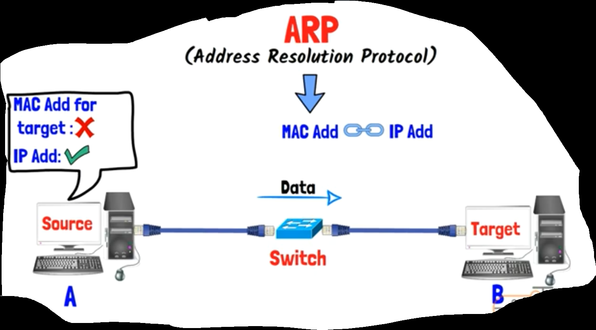
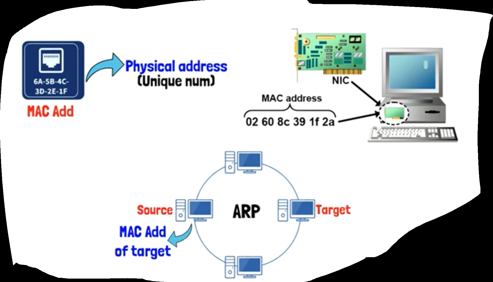
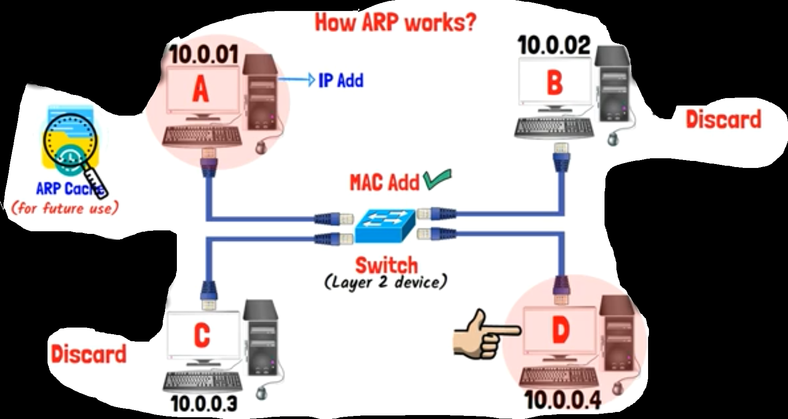
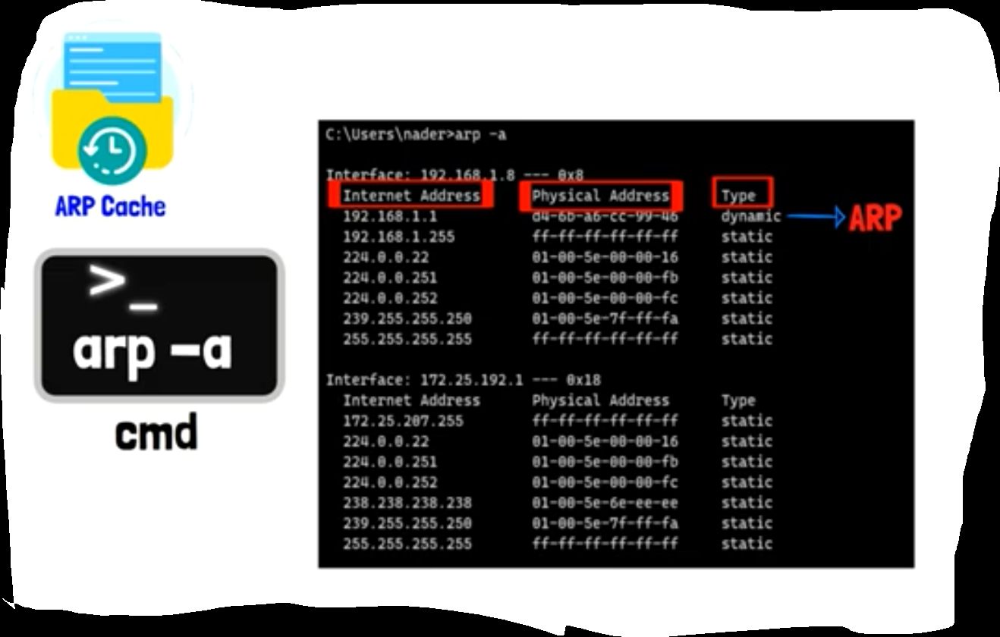

## Intro

- assume that we have 2 devices A & B
- now, A(source device) want to send Data to B(destination or target device)
- the 2 devices are connected to switch across (Ethernet Cable)
- A to be able to send Data to B, It must know the (MAC Address) of it
- but the problem is that (the source device) know only the (IP Address) of the (target device)
- here we can solve this problem using something called (ARP, address resolution protocol)
- its aim is recognize on the (MAC Address of the target device) & link it with its (IP Address)

​      

## Why ARP?

- as we said before, MAC Address is a physical address for a specific device
- it is a UNIQUE Number
- it is made for (NIC, network Internet card)
- any device want to talk to another one in a LAN Network, the source device must have the mac address of the target device. (That's our role at this case!)
- so, the devices use (ARP) to be able to get the Mac Address of the target devices

​      

## How ARP Works?

- assume that we have 4 devices connected with a Switch (A, B, C, D)
- and those devices have addresses from (10.0.0.1 to 10.0.0.4)
- assume that A want to talk to B
- A know the (IP Address) of D
- But (Switch) is => (layer 2 device) => it only can understand the (MAC Address) => it can't recognize the (IP Address) that exist in the (layer 3)
- so, A to be able to talk to D, it must find a way to get its MAC Address
- you should know that => IP Address can locate a specific device on a specific Network
- But => The MAC Address identifies the actual device
- so, in the previous example, A to be able to get the (MAC Address) of D
- the first thing it will do is to look at its (ARP Cashes)
- if it find the (MAC Address) of D there, it will connect with D and send Data directly 
- but if it didn't find (MAC Address) there
- at this case A will send (Broadcast message) for all devices in that Network, to ask about (MAC Address) of the (IP Address) that it has now
- in our example => B & C devices will read Broadcast message that A sent
- and they will find that (A) request the (MAC Address) of the (IP Address) of (10.0.0.4) that belong to (D)
- so, B & C will discard the (Broadcast message)
- But D will accept the (Broadcast message), and will respond A by sending its MAC Address to it
- as soon as A know the MAC Address of D, it will send Data to it
- and at once, A will store the both (IP Address) and its (MAC Address) in (ARP Cashes) for future use
- this storing action increase the network performance &  decrease from (Traffic)

​      

## How to see existed device in your ARP Cashes

- open CMD
- write the command => (arp -a)
- you will find (IP Address), (MAC Address), and (Type)=>(select if the mac address is found by ARP technique if it takes dynamic or we manually entered it if it is static)

​      