## Intro

- Hub, Switch & Router are possible part of any Network
- we as all of them to form a Network
- but the difference among them is the way that they deal with the Data

## Hub

- It is the simplest device of them
- It is purpose is to connect devices in one local Network
- It is the 1st Generation of (Network Devices)
- It contains number of ports to connect a number of devices with it
- It deals with connected devices by (Ethernet Cables Connections)

`How it works`

- when a device send data to the (Hub)

- (Hub) sends it to all devices connected to it

- Because (Hub) didn't know anything about the (Packet), or what is the device should receive that data

- He only know that (When Data come to it, it should send it to all existed ports in it) to reach all devices connected to it

- It looks like the (Electric switch) but instead of traversing (electric), it traverse (data)

- So, we can call it (Repeater)

- `ex`

- assume that I have 4 devices connected to a (Hub) => (A, B, C, D)

- A want to send Data to D

- D will receive the Data, but not alone

- C & B will receive the data too, and after receiving they will find that (IP Address) is difference

- so, they will understand that that data didn't be send to them, so they will discard it

  ​      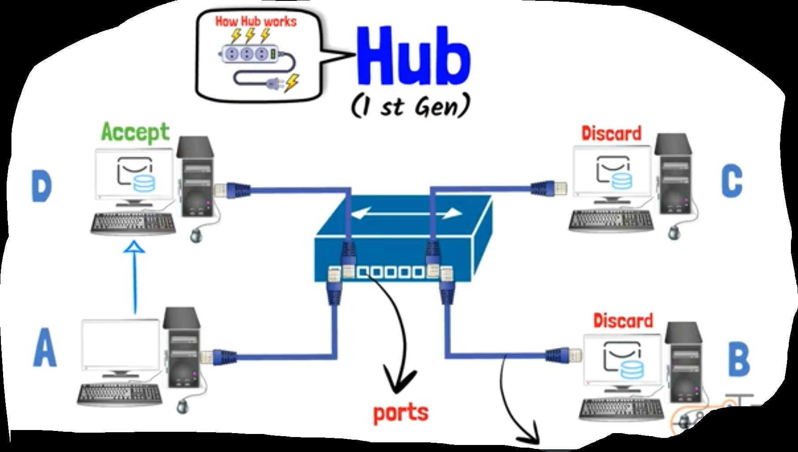

- `Disadvantages`

  - So this mechanism that all Devices in your Network receive the Data => this cause security problems

  - and it cause a big unnecessary traffic we don't need it => and this will affect on (Bandwidth)

  - (Hub) has no relationship with (Data Addresses)

  - in other meaning (Hub) can't deal with (IP) or (MAC) Addresses

  - it only (Repeats) Data coming to it

  - so, it is considered to be (layer 1 device)

  - in other meaning, it can only work in (physical layer)

  - (Hub) use technology of (Half-duplex) => can't send & receive data at the same time

  - Because if this happened in (Hub) => it will cause data collision => data won't be send, and must resend again

  - This clarify that (Hub) isn't intelligent device and can't deal with big Networks => it is old technology

    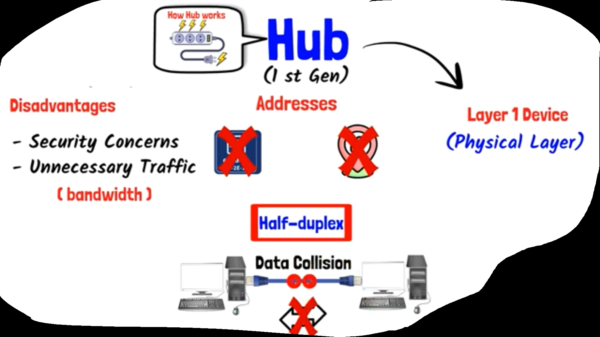

- Because of these Several Disadvantages of (Hub), Switch is appeared

## Switch

- looks like (Hub) in the Shape

- It has a number of Ports, & accept Ethernet connections

- but it is more intelligent than (Hub), Because it deals with (MAC Address), So it can recognize which device is connected to which port

- So, when there is a (data Packet) is sent to it, (Switch) will recognize on (MAC Address) of the target device and will send data to it only

  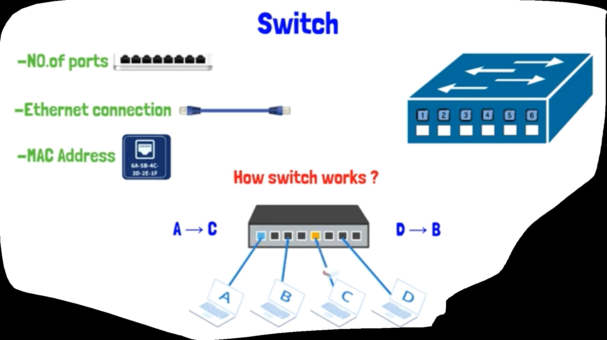

 - `ex`

 - Assume that i have 2 devices connected across (Switch) => (A, B)

 - Assume that A Mac Address is => AA-AA-AA-AA-AA-AA => connected to port 1 in the switch

 - & B MAC Address is => BB-BB-BB-BB-BB-BB => connected to port 6 in the switch

 - at this case (Switch device) can recognize the MAC address of the both and will but it in something called (MAC Address Table),

 - such that (port 1 interface => AA-AA-AA-AA-AA-AA) & (port 2 interface => BB-BB-BB-BB-BB-BB)

 - now, switch can handle messages between the 2 devices using their MAC Addresses

 - now, assume that i added another 2 devices => (C, D)

 - at first you should know that the (Switch) isn't know anything about MAC Addresses of any device connected to it => So, (Switch MAC Address Table) will be empty

 - so, at this time, if A wants to talk to D, => Switch don't know anything about D MAC Address

 - then, (Switch) will send the data to all ports of it to be send to all connected devices on it

 - so, at this case (Switch) can work as a (Hub) when (MAC address Table) is empty

 - But the (Switch) after that has the ability to store (MAC Addresses) for all devices in the Network in the (Switch MAC Address Table) to use it in handling traversing data among devices later

 - so, in the example, when D respond A => the switch will send to A that he found the target device and data will be send to D

   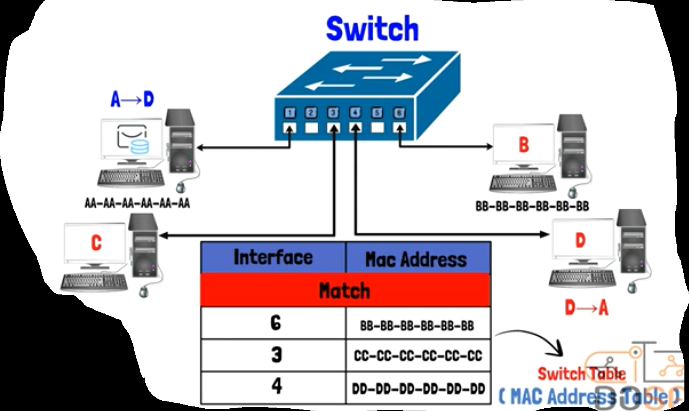

- `Advantages`

  - using Switch MAC Address-Port Table it can make fast-detection for a device

  - it considered as (layer 2 device) => (it is work area is in [Data Link Layer])

  - it used Technology of the (Full-duplex) => send & receive Data at the same time

  - and this decrease from probability of happening data collusion => (4-multiple collusion domain)

  - It saves Bandwidth from unnecessary traffic

  - Increases from data security 

    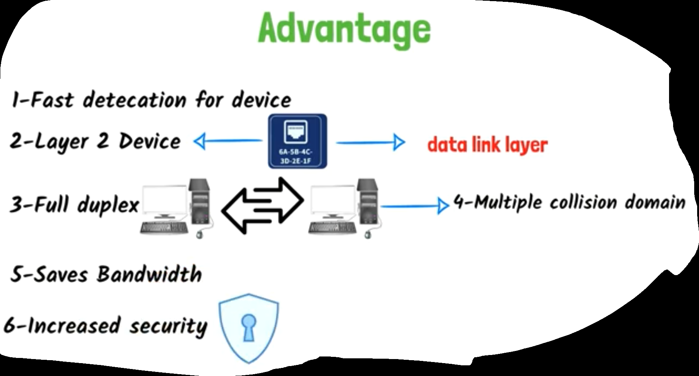

- now we saw that (Hub & Switches) achieved the connections among devices and I can use it to form a LAN Networks
- But If I want to build a Big Network Like (WAN, Wide Area Network), at that case I need some-device deal with (IP Addresses)
- so, the Router devices was appeared

## Router

- you can considers that the router is the gateway for the outside world or any other Network

  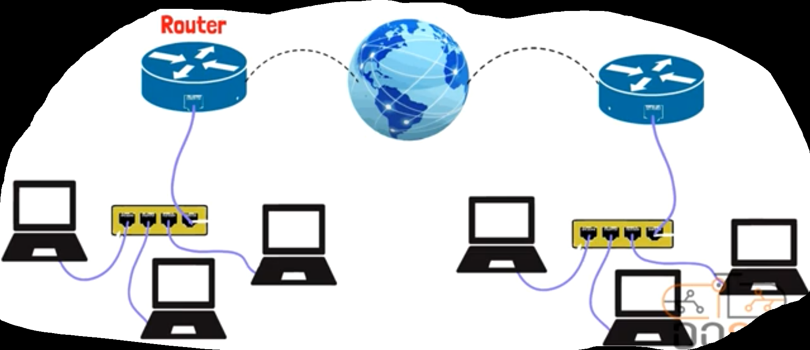

- `ex`

- when you want to send a message on FACEBOOK

- the role of Router at that case is to Prepare or initialize the road for your message to reach FACEBOOK Server

- so, when your message get out from your Network, the router will follow and ensure that your message passed from Network to another until it reaches to the Target or Destination

- and this process will happen each time you get into the internet

- so, you can considers that (modem router) you have is the (mid-device) between (your private network) & (internet service provider) like (VODAFONE, WE, ETC...)

- Router work on (traversing data process or orientation process) using (Network Address) that's (IP Address)

- so, Router is => (layer 3 device)

- `ex`

- Assume that (your Router) connects 3 Networks

- Network IP Addresses are respectively => (10.0.0.0, 20.0.0.0, 30.0.0.0)

- Assume that Networks Interfaces or Ports are respectively => (E1, E2, E3)

- Router to be able to made (orientation process), it build something called (Routing Table)

- (Routing Table) contains => (Interface, Network Address, & other things)

- the router can reach Network according to each interface it stored in the (Routing Table)

  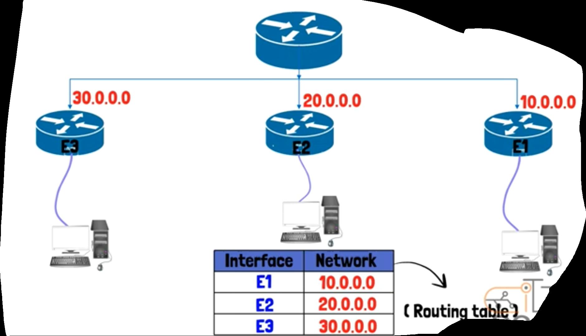

- `How (orientation process) happens & How can router reach Network Addresses`

  - `ex`

  - Assume that you have 2 devices in 2 difference Networks

  - A  => IP Address(10.0.0.2), MAC Address(AA-AA-AA-AA-AA-AA)

  - B  => IP Address(30.0.0.2), MAC Address(BB-BB-BB-BB-BB-BB)

  - now, if A wanted to talk to B => he couldn't make it neither directly nor using (Hub nor Switch)

  - Because B is in another Network, so it must use Router

  - also, Each (Interface) in Router has (IP address) & (MAC address)

  - so, let us assume that

  - (1st router) has interfaces and IP Addresses (E1=> 10.0.0.1, E2=> 20.0.0.1)

  - (2nd router) has interfaces and IP Addresses (E3=> 20.0.0.1, E4=> 30.0.0.1)

  - and device A exists in (Network1) of (IP Address) => 10.0.0.0

  - and device B exists in (Network3) of (IP Address) => 30.0.0.0

  - and Routers devices are in (Network2) of (IP Address) => 20.0.0.0

    ​      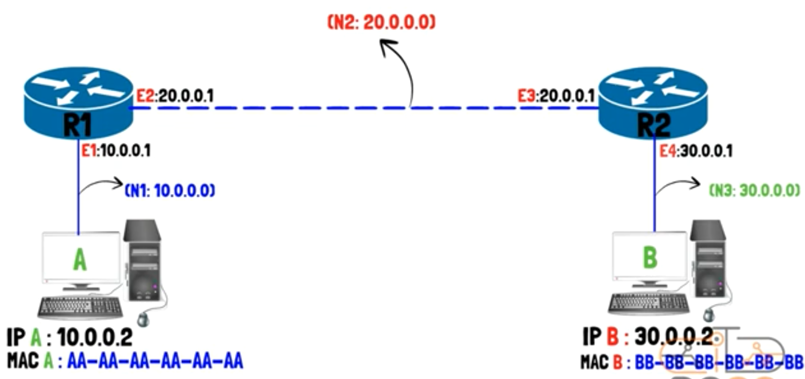

  - now, let us see what will happen to (data packet or message) that will get out from(source) until reach (target)

  - if we look at that message as (a frame) in (layer 2) I will find the (IP addresses) of the (source) & (target) from the (layer 3)=>that's (Network Layer)

  - In this frame, (source IP) will be => 10.0.0.2 & (target IP) will be => 30.0.0.2

    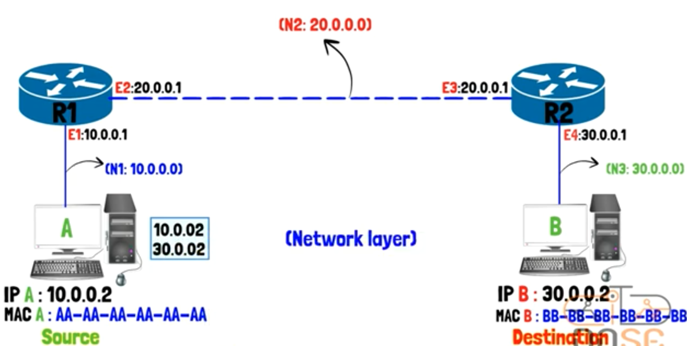

  - an after that in (layer 2) => it will add (source MAC) & (target MAC)

  - (the source MAC) will be the (MAC Address) of device A

  - But be aware! => (Destination MAC) will differs according to the (destination or target device), if that device inside the Network or not!

  - [If the (target device) inside the same Network] and (source device) know its (MAC Address) it will add it in the (message frame) directly

  - [But If the (target device) isn't inside the same Network] the (source device) will seek help from (ARP, address resolution protocol)

  - and at this case, (ARP) won't search about the (target device) directly => (device B)!

  - because device B doesn't exist with device A at the same Network

  - but it will search about (MAC Address) of (the default gateway) => (Router Interface that exists with device A at the same Network and will help device A to get out from its local Network to the outside world)

  - so, the (target device) at this case will be (Router1) that its interface is (E1)

  - so, the (ARP) will do its (steps) and search about the (MAC Address) that belong to (IP Address) of (E1) that's (10.0.0.1)

    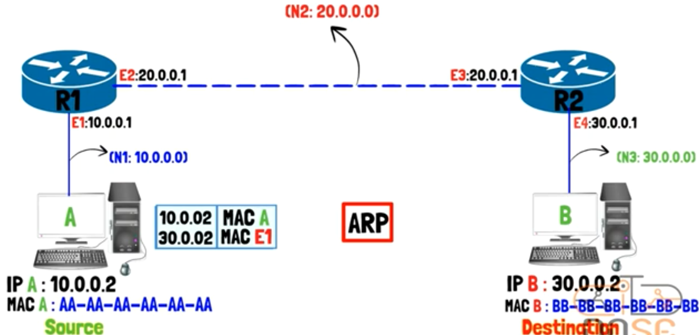

  - now, the (message frame) is ready to go out from (device A) and go to (the local router) with device A in the same Network

  - once the (Router1) receives the (message frame), it will make (decapsulation process), to know the (IP Address) of the (Destination or Target device)

  - at this time, (Router1) will know that it needs to reach Network of (30.0.0.0) to be able to send the Data to (device B)

  - since (router 1) is connected to another router that's (router 2), so it can traverse the message from interface(E2) to interface(E3)

  - so at this case to do that, (Router 1) will carry the portion of (source & target MAC Addresses)

  - and start to built new (message frame) with the new (MAC Addresses) that suits dealing with the other router=>(Router 2)

  - so, the new (message frame) will contains the (MAC Address of source device=> router1(E2)) & the (MAC Address of target device=> router2(E3))

    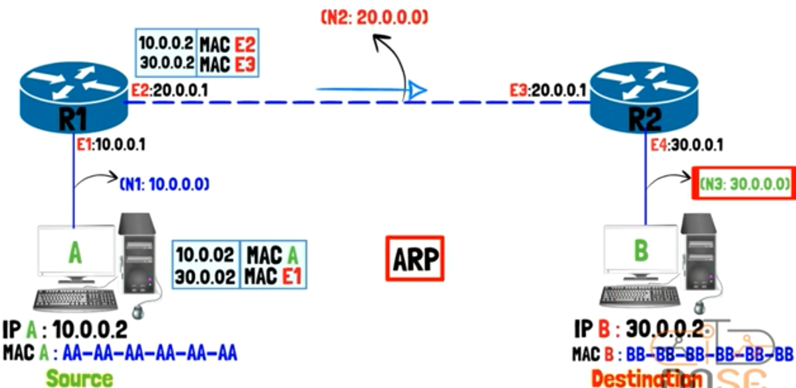

  - so, the (message frame) will get out from (the interface (E2)) and reach (the interface (E3)) in the another Network

  - now, (Router 2) has (the message frame)

  - so, it will do the same processes 

  - it will do decapsulation for (the message frame)

  - and it already has the destination IP Address in (the message frame)

  - so, it will change (MAC Addresses) in (the message frame) it has

  - so, it will make (MAC Address source device) is=>(MAC of interface E4 or MAC of Router 2) 

  - and (MAC Address target device) is=>(MAC of interface device B) => it will get it using (ARP), too

    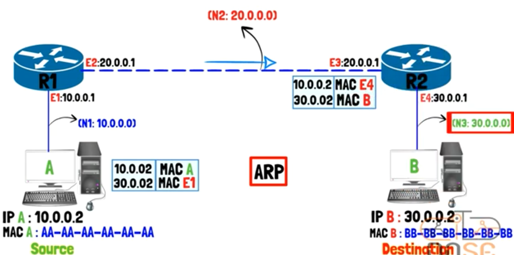

  - finally, (the message frame) will be sent to (the target device B)

    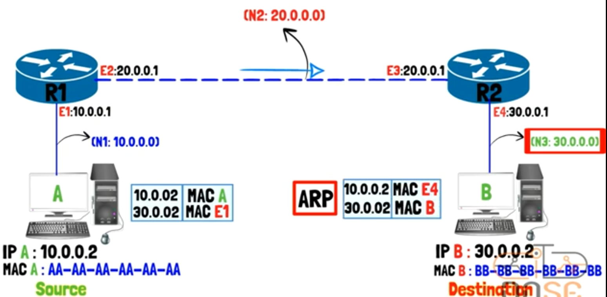

  - (notice): all the way between the device A & device B => IP Addresses don't be changed, (MAC Addresses) are changed only => and this clarify the importance of (ARP)

  -  all of this (a very simple clarifying) for (Routing Process)