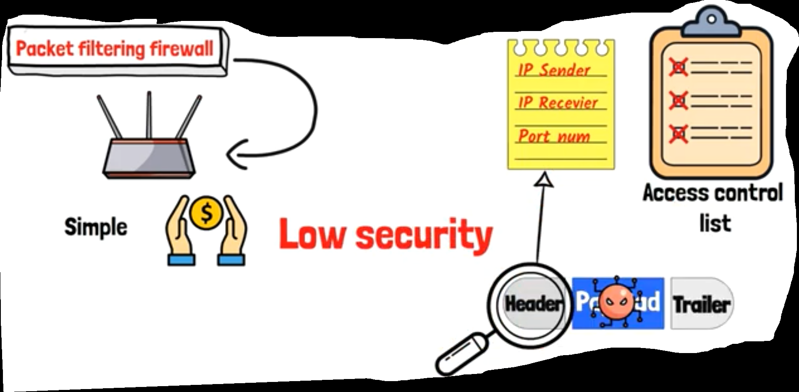

## Intro

- we will discuss the 4th device of (Network devices)
- It is (Firewall Device)

## Firewall Major

- Protecting your device from outside harmful things, like (Viruses or Hackers)
- Because, It can Monitors (the traffic) between (your device) & (other Networks)
- It can also filtering passed data according to specific main rules, and can mange data if it can pass or not

## Firewall Shapes

- There are 2 Shapes of Firewall

  - > Software

    - It is (Host-based firewall)
    - in other meaning it is specialized for protecting 1 device only
    - look like the firewall that exists on your device by default on (Windows Operating Systems)

  

  - > Hardware

    - It is a real Hardware device
    - It exists between your local device Network and The Internet

    - so, If there is a company that has a big Network 

    - It should has a firewall device to protect its devices from any directly Hacking during connecting with the internet

    - This already will be with (software firewall) that come with each device

      ​       

- when we use the 2 shapes of Firewall => that's called (Network-based Firewall)

- (Internet Network) in the opinion of (Security) is (Untrusted Network Zone)

- Because anyone can use (Internet Network) & Hackers can send anything across it

- so, existing firewall between your local device and (the internet network) is so important

- Because firewall is the thing that will check all messages that are sent to you and ensure form the safety of them and they are secure

- Secure means that it follow (The Security Criteria) of the firewall

- so, if the firewall find that data is secured, it will allow it to pass to your device

- otherwise, It will be blocked

- `ex`

- when you open the browser and write as example (www.youtube.com)

- the previous (request) will be send to (the internet network)

- then, there is a reply will come to that (request) from (the server) that stores (website contents) you requested

- and finally, (the website contents) will be sent to your device and appear on your screen 

- But, Hackers can Hack the previous connection between your device and (the server)

- and can have access on your device with taking sensitive information from your device like passwords, bang details, or credit card details

- at this case, it is clear the importance of existing firewall on your device that can protect your device from those Hackers

## Firewall Types

- `Packet Filtering Firewall`

  - It depends on (Packets) concept

  - `ex`

  - when you download a file that has size 100MB

  - at this case you don't download this a file as whole 

  - but, your device starting receives a groups of small packets

  - as example 5MB-Packet per a second, until reaching 100MB of the whole file

  - Each 5MB-packet your device receives contains some info. like:

    - which device sends the data

    - which device receives the data

    - and their IP Addresses of Sender & Receiver devices => all the previous called (Header)

    - and the rest of 5MB contains (the actual data) we want to download => called (Payload)

      

  - It is looks like (Checkpoint), Because It collect some Information about (the packet) like
    - (sender IP Address)
    - (receiver IP Address)
    - port Number
    - After that It starts to compare all them according to the (security standards) that exists in something called (Access Control List)
    - If Data achieve all (Security Standards) it will be passed
    - otherwise, it will be blocked
    - but, what is (the port number)?!
    - it is a group of numbers existed after (the IP Address), and it is separated from (IP) with (:)
    - port number is so important in (the process of traversing data) & (the packet filtering)

  - (Packet Filtering Firewall) => is the type of firewall that existing in your (Router)

  - It considered as the simplest and most cheaper firewall

  - the lone problem with it => that it is focus is on (IP Address) & (packet port number) only, and don't check (the payload or the actual data)

  - and this put us in a risk => because Hackers can put harmful something in (the payload)

  - so, (Packet Filtering Firewall) is (Low Security)

    

  - `ex`

  - assume that (person1) wanted to access website (www.example.com) on the browser

  - and (person2) is inserted in (Access Control List) under (the blocked devices)

  - when (person2) tries to access (the connection) during (person1) accessing (the website) to send some harmful data to (person1 device)

  - (the firewall) will check the (IP Address) from (the packet) coming from (person2)

  - the firewall will find that (packet) is listed under (the blocked devices)

  - so (the firewall) will block (the whole packet) coming from (person2)

- `Stateful Inspection Firewall`
  - It is not only check (the sent packet) like (Packet Filtering Firewall)
  - but it also, check (The Network Connection Case) & (The Session) you work on it
  - and starts to compare (the coming packets) with (the session packets)
  - and if it find (the coming packets) not similar to (the session packets) or at least (the coming packets) is part of (the session packets) it will reject (those coming packets)
  - so, it is more secure
  - `ex`
  - assume that you are now watching a video on YOUTUBE
  - so, (The Stateful Inspection Firewall) will start to store (all info. about your session) inside something called (conversation list)
    - like your device name
    - IP address
    - the current website name you work on
    - and the IP Address of the current website
  - at this time, if some-hacker tried to make a hacking process in your connection with the website
  - assume his hacking process represented in sending harmful data to your device
  - but (the firewall) at this time know that you are accessing the YOUTUBE website
  - so, when the firewall analyze the Hacker packet, it will find that it is not belong to (the YOUTUBE packet) you open now
  - so, the hacker packet will be blocked from the firewall

- `Proxy Firewall`

  - `story`

  - there are (person1) & (person2)

  - (person1) want to buy something form (supermarket)

  - but he has some problems with the owner of the supermarket

  - he request from (person2) to go to the supermarket and buy instead of him

  - Proxy firewall idea likes that ...

  - `ex`

  - when your device want to make a request to access the YOUTUBE website

  - but the accessing process don't happen directly 

  - how?!

  - at this case you in need to something called (proxy firewall device)

  - your device will send request to (the proxy firewall device), that it wants to access YOUTUBE website

  - and (the proxy firewall device) will make a request to (the YOUTUBE Server) instead of your device

  - then your device will receive the respond from (the proxy device) after it reach from (the YOUTUBE server)

  - at this case, Your device could access the (YOUTUBE website) indirectly

  - so, (the proxy firewall) is considered as (mid-device) that protect your device by way making your device doesn't deal with (the Internet Network) directly

    

    

- `Application Firewall`

  - It is called also, (web application firewall or WAF)

  - It is specialized for protecting (web applications)

  - so, It is always existing with (web servers)

  - It is role that monitoring (the traffic) of (the web application) and block any (suspicious traffic)

  - It adds secure-layer by way checking (the traffic content) of (The Web Protocols), like http & https

  - and starts to applicate some main secure-rules specialized for (web application)

  - and unlike most firewalls that works in (transport layer of OSI Model) => (the application firewall) works in (the application layer)

    

- `Next-Generation Firewall (NGFW)`

  - with development of Hackers attacks & their used-apps, It was necessary to exist some developed firewall that able to analyze data in deeper way and find out the modern cyber-attacks

  - and that's the major of (NGFW)

  - It is so intelligent firewall, because it collects a lot of smart and modern features guaranteed that connection is more secure

  - some features of it ...

  - It can make 

    - (URL Filtering & Web Filtering)

    - DPI => Deep Packet Inspection => It check the packet connect in so deeper way to ensure that there isn't any attacks

    - It Integrates (The IPS) => Intrusion Prevention System => this happens after (firewall step) => after (the packet) pass from (the firewall) it get into (The IPS) => and (IPS) can find out any (strange behavior) or (repetitive behavior) in the Network => likes (repetitive updates on files) or (repetitive copy processes) and so on => if it finds something like that => (IPS) will block (that Packet)

    - so, It is the most modern firewall It has been reached

      